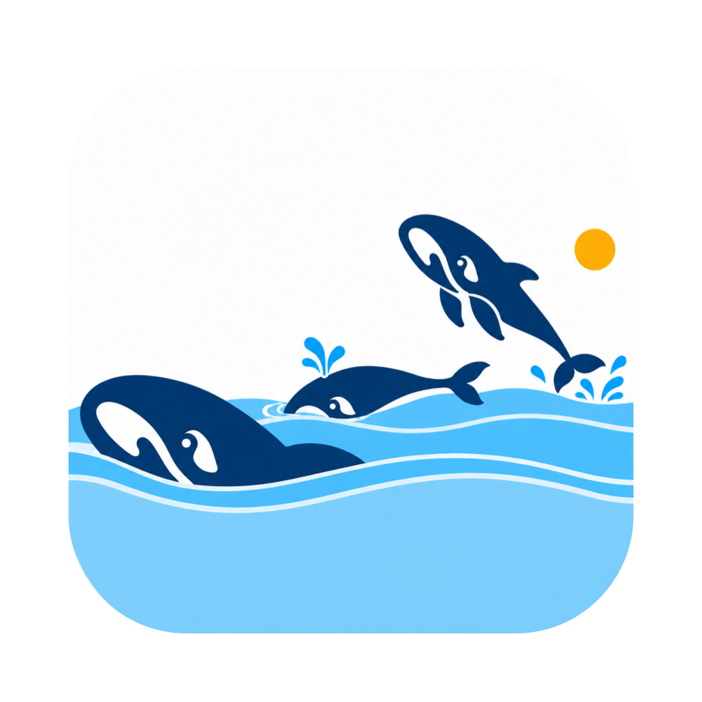

<p align="center">
  
</p>

<h1 align="center">WhalePod · 鲸群</h1>

<p align="center">
  <strong>让多个 AI 会话并排工作。</strong><br>
  基于 DeepSeek Harness 的多会话工作台，参考 Matou 的操作方式，<br>
  把项目、事项、会话卡片和分支关系放在同一个窗口里。
</p>

<p align="center">
  <a href="LICENSE"></a>
  
  
  
</p>

<p align="center">
  <a href="#主要功能">主要功能</a> ·
  <a href="#安装与开发">安装与开发</a> ·
  <a href="#项目结构">项目结构</a> ·
  <a href="#当前边界">当前边界</a>
</p>

鲸群适合同时推进几个任务：一张卡片查资料，一张写方案，另一张继续实现。每张卡片保留自己的会话；需要试另一条路线时，创建分支，再从关系图回到对应会话。

模型、消息、工具调用、审批和文件能力继续使用 DSH。鲸群负责工作台布局与交互，不另建一套 Agent 运行环境。

> **预览版本。** 本仓库包含布局插件源码、测试、图标，以及配套 DSH 补丁。它不是开箱即用的独立 Electron 工程。当前桌面验收环境是 macOS Apple Silicon；其他平台尚未完成实际验收。

## 主要功能

### 项目、事项与会话卡片

| 层级 | 用途 |
| --- | --- |
| 工作区 | 按项目目录组织工作 |
| 事项 | 把同一件事的会话放在一起 |
| 会话卡片 | 独立输入、查看回复、运行 Agent |
| 会话分支 | 保留父子关系，追踪不同尝试 |

- 多张会话卡片横向排列，在当前卡片旁边新建会话。
- 拖动调整卡片宽度，双击卡片头恢复默认宽度。
- 长按卡片头后拖动排序，保存宽度与顺序。
- 从事项入口打开 DAG，查看会话关系并定位会话。

### 从已有会话继续工作

在空白会话的添加菜单里导入当前项目下的 Claude Code 或 Codex 历史。支持来源筛选、搜索、分页预览和重新扫描。

导入的是文字记录，原会话保持不变。图片、附件、工具执行环境和隐藏推理不随文字导入，历史命令也不会自动重跑。

### 技能与连接器

统一管理 Skills 和 MCP，选择全局或指定项目生效。支持导入技能文件夹、Markdown 和 ZIP 技能包，以及配置、测试连接器。

项目与全局存在同标识配置时，按范围解析有效配置，保留来源信息。配置历史与外部软件包版本是两回事，并非所有来源都具备版本升级能力。

### 状态与通知

通过会话、事项、工作区标记和通知中心查看需要关注的任务，从通知定位相关会话。声音提示受应用焦点、交互和通知设置影响；实际提醒效果需在桌面客户端验收。

## 安装与开发

### 使用桌面客户端

当前开发包面向 **macOS Apple Silicon**。本仓库首次发布以源码为主，安装包另行发布；请勿把源码 ZIP 当成 App。

现有测试安装包使用本地临时签名，尚未完成 Apple 公证。正式分发还需要补齐签名、公证及独立机器上的首次安装验证。

### 从源码开发

需要 Node.js（版本见 `.node-version`）、pnpm（版本见 `package.json`）及匹配的 DeepSeek Harness 源码。开发依赖使用相邻目录的 `link:`，单独运行 `npm install` 并不足以启动项目。

推荐目录：

```text
workspace/
├── deepseek-harness/
└── whalepod/
```

获取源码并应用配套补丁：

```bash
git clone https://github.com/icesword0760/whalepod.git
git clone https://github.com/deepseek-ai/deepseek-harness.git
cd deepseek-harness
git checkout "$(cat ../whalepod/patches/BASE_COMMIT)"
git apply --check ../whalepod/patches/dsh-0.1.5.patch
git apply ../whalepod/patches/dsh-0.1.5.patch
mkdir -p apps/desktop/assets/matou
cp ../whalepod/assets/app-icon/AppIcon.icns apps/desktop/assets/matou/AppIcon.icns
```

然后按 DSH 自身的开发说明安装并构建依赖，再检查插件：

```bash
cd ../whalepod
pnpm run setup:dev
source .dev-env
pnpm run check
```

`check` 执行类型检查、构建和自动化测试。插件的内部包名暂时保留为 `dsh-plugin-matou-layout`，以兼容现有安装与数据；产品名和 GitHub 仓库名使用 WhalePod。

补丁基线、验证范围和桌面构建注意事项见 [开发说明](docs/development.md)。上述完整流程尚未在全新机器上逐步验收。

## 项目结构

```text
src/
├── client/         工作台、会话卡片、DAG、通知与管理面板
├── org/            工作区与事项组织
├── control/        会话控制
├── capabilities/   技能与连接器
└── import/         外部会话扫描与导入
tests/              自动化测试
patches/            匹配 DSH 基线的补丁
assets/app-icon/    鲸群图标及 macOS 导出资源
scripts/            开发辅助与图标导出
```

## 当前边界

- 部分能力依赖 `patches/` 中的 DSH 改动，纯布局插件无法替代这些客户端与宿主改动。
- 插件关闭后回到 DSH 官方布局，布局切换按重启边界生效。
- 自动化通过不代表每个真实窗口中的拖拽、滚动、通知和首次安装场景都已验收。
- 外部会话格式会随来源工具升级变化，导入异常请附来源、版本和脱敏后的错误信息。
- 仓库不包含个人会话、API 密钥、已安装插件备份或本机运行配置。

## 来源与许可

采用 [MIT License](LICENSE)。布局起点来自 DeepSeek Harness 官方 `ui-layout`；Matou 是产品交互参考。第三方声明见 [THIRD_PARTY_NOTICES.md](THIRD_PARTY_NOTICES.md)。

WhalePod 是独立社区项目，非 DeepSeek 官方客户端；相关名称与标识归各自权利人所有。
